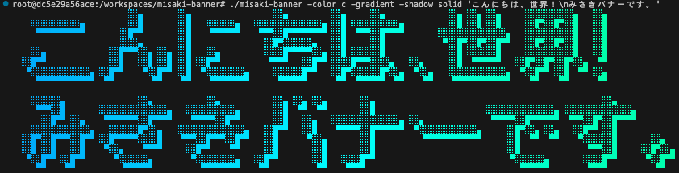

# misaki-banner



[日本語](#日本語) | [English](#english)

---

## 日本語

8×8ドットの[美咲フォント](https://littlelimit.net/misaki.htm)を使って日本語テキストをバナー表示するCLIツールです。\
[oh-my-logo](https://github.com/shinshin86/oh-my-logo/tree/main)に触発されて開発されました。

## クイックスタート

npxから直接実行できます。
```bash
npx misaki-banner "こんにちは"
```

## インストール

#### Go

```bash
go install github.com/qraqras/misaki-banner/cmd/misaki-banner@latest
```

#### npm

```bash
npm install -g misaki-banner
```

#### バイナリ

[GitHub Releases](https://github.com/qraqras/misaki-banner/releases) から OS 別のバイナリをダウンロードできます。

## 使い方

```bash
misaki-banner [オプション] <テキスト>
```

### オプション

| フラグ | 説明 | デフォルト |
|---|---|---|
| `-color` | 文字色: `c`, `m`, `y`, hex (`RRGGBB`), RGB (`r,g,b`) | - |
| `-font` | フォント名: `misaki_gothic`, `misaki_gothic_2nd`, `misaki_mincho` | `misaki_gothic_2nd` |
| `-gradient` | 文字色のグラデーション有効 | - |
| `-shadow` | 影スタイル: `outline` (罫線), `solid` (塗りつぶし) | - |

### 例

```bash
# 基本
misaki-banner "こんにちは"

# フォント
misaki-banner -font misaki_mincho "こんにちは"

# 影
misaki-banner -shadow outline "こんにちは" # 罫線
misaki-banner -shadow solid "こんにちは"   # 塗りつぶし

# 文字色
misaki-banner -color c "こんにちは"       # シアン
misaki-banner -color m "こんにちは"       # マゼンタ
misaki-banner -color y "こんにちは"       # イエロー
misaki-banner -color FF0000 "こんにちは"  # 赤
misaki-banner -color 255,0,0 "こんにちは" # 赤

# 文字色 + グラデーション
misaki-banner -color c -gradient "こんにちは"
misaki-banner -color FF0000 -gradient "こんにちは"

# 文字色 + グラデーション + 影
misaki-banner -color c -gradient -shadow outline "こんにちは"
misaki-banner -color c -gradient -shadow solid "こんにちは"

# 改行
misaki-banner "こんにちは\n世界"
```

## 開発

### ビルド

```bash
go build -o misaki-banner ./cmd/misaki-banner
```

### テスト

```bash
go test ./...
```

### リリース

[GoReleaser](https://goreleaser.com/) を使用して自動リリースします。

1. バージョンタグを作成:
   ```bash
   git tag -a v1.0.0 -m "Release v1.0.0"
   git push origin v1.0.0
   ```

2. GitHub Actions:
   - Linux/macOS/Windows 向けにビルド
   - GitHub Releases にバイナリを公開
   - checksums と changelog を生成

ローカルでテストビルドする場合:
```bash
goreleaser build --snapshot --clean
# → dist/ ディレクトリに成果物が生成されます
```

---

## English

A CLI tool that displays Japanese text as banners using the 8×8 dot [Misaki Font](https://littlelimit.net/misaki.htm).\
Inspired by [oh-my-logo](https://github.com/shinshin86/oh-my-logo/tree/main).

## Quick Start

Run directly with npx:
```bash
npx misaki-banner "Hello"
```

## Installation

#### Go

```bash
go install github.com/qraqras/misaki-banner/cmd/misaki-banner@latest
```

#### npm

```bash
npm install -g misaki-banner
```

#### Binary

Download OS-specific binaries from [GitHub Releases](https://github.com/qraqras/misaki-banner/releases).

## Usage

```bash
misaki-banner [options] <text>
```

### Options

| Flag | Description | Default |
|---|---|---|
| `-color` | Text color: `c`, `m`, `y`, hex (`RRGGBB`), RGB (`r,g,b`) | - |
| `-font` | Font name: `misaki_gothic`, `misaki_gothic_2nd`, `misaki_mincho` | `misaki_gothic_2nd` |
| `-gradient` | Enable color gradient | - |
| `-shadow` | Shadow style: `outline` (border), `solid` (filled) | - |

### Examples

```bash
# Basic
misaki-banner "Hello"

# Font
misaki-banner -font misaki_mincho "こんにちは"

# Shadow
misaki-banner -shadow outline "Hello" # border
misaki-banner -shadow solid "Hello"   # filled

# Color
misaki-banner -color c "Hello"       # cyan
misaki-banner -color m "Hello"       # magenta
misaki-banner -color y "Hello"       # yellow
misaki-banner -color FF0000 "Hello"  # red
misaki-banner -color 255,0,0 "Hello" # red

# Color + gradient
misaki-banner -color c -gradient "Hello"
misaki-banner -color FF0000 -gradient "Hello"

# Color + gradient + shadow
misaki-banner -color c -gradient -shadow outline "Hello"
misaki-banner -color c -gradient -shadow solid "Hello"

# Line breaks
misaki-banner "Hello\nWorld"
```

## Development

### Build

```bash
go build -o misaki-banner ./cmd/misaki-banner
```

### Test

```bash
go test ./...
```

### Release

Automated releases using [GoReleaser](https://goreleaser.com/).

1. Create a version tag:
   ```bash
   git tag -a v1.0.0 -m "Release v1.0.0"
   git push origin v1.0.0
   ```

2. GitHub Actions:
   - Build for Linux/macOS/Windows
   - Publish binaries to GitHub Releases
   - Generate checksums and changelog

To test build locally:
```bash
goreleaser build --snapshot --clean
# → Artifacts will be generated in the dist/ directory
```
